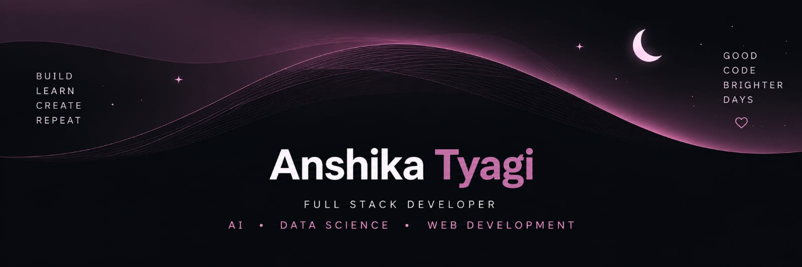

 

<!-- ==================== HELLO WORLD ==================== -->

 

 

<!-- ==================== WHO AM I ==================== -->

  

<table>
<tr>
<td width="62%" valign="top">

### Hey, I'm Anshika 🌷

I came into engineering with a love for **making things pretty** —  
and somewhere along the way, I started loving the code behind them too. ✦

I'm a **B.Tech AI & Data Science student** and a **Full Stack Developer** who enjoys turning ideas into clean, useful and thoughtful digital experiences.

</td>

<td width="38%" align="center" valign="middle">

 

🌸 **create**

✦

🎨 **design**

✦

💻 **build**

✦

✨ **learn**

  

curious mind · creative eye · code enthusiast

</td>
</tr>
</table>

 

  ♡ making ideas feel a little more alive

 

<!-- ==================== CURRENTLY FOCUSED ==================== -->

  

<table>
<tr>

<td width="50%" align="center">

 

### 💻
### FULL STACK

Building complete web experiences
with clean frontend + backend systems

  

</td>

<td width="50%" align="center">

 

### 🧠
### AI & ML

Exploring intelligent systems,
machine learning & practical AI

  

</td>

</tr>

<tr>

<td width="50%" align="center">

 

### 📊
### DATA

Working with data, analysis,
visualization & insights

  

</td>

<td width="50%" align="center">

 

### 🎨
### UI & DESIGN

Making interfaces feel clean,
simple & visually thoughtful

  

</td>

</tr>
</table>

 

<!-- ==================== EXPERIENCE ==================== -->

<!-- ==================== TECH STACK ==================== -->

  

 

 

 

 

 

<!-- ==================== FEATURED INTERESTS ==================== -->

  

<table>
<tr>

<td width="50%" align="center">

### 🌐 Web Development

Full-stack applications · APIs · UI

</td>

<td width="50%" align="center">

### 🤖 AI & ML

Machine learning · intelligent systems

</td>

</tr>

<tr>

<td width="50%" align="center">

### 📊 Data Analysis

EDA · visualization · insights

</td>

<td width="50%" align="center">

### 🎨 Creative UI

Clean interfaces · visual experiences

</td>

</tr>
</table>

 

<!-- ==================== GITHUB STATS ==================== -->

  

<table>
<tr>

<td width="50%" align="center">

</td>

  

</tr>
</table>

 

<!-- ==================== LET'S CONNECT ==================== -->

  

 

  <a href="https://www.linkedin.com/in/anshika-tyagi-2b66a531b/">
    
    <strong>&nbsp; LINKEDIN</strong>
  </a>

  &nbsp;&nbsp;&nbsp;&nbsp;&nbsp;&nbsp;

  <a href="mailto:anshikatyagi00@gmail.com">
    
    <strong>&nbsp; GMAIL</strong>
  </a>

  &nbsp;&nbsp;&nbsp;&nbsp;&nbsp;&nbsp;

  <a href="https://github.com/anshikaa999">
    
    <strong>&nbsp; GITHUB</strong>
  </a>

 

  🌷 &nbsp;&nbsp;&nbsp;&nbsp; 🌷 &nbsp;&nbsp;&nbsp;&nbsp; 🌷

 

<!-- ==================== FOOTER ==================== -->

made with curiosity, creativity & a little bit of chaos ♡

  

✦ &nbsp; ✦ &nbsp; ✦

 

